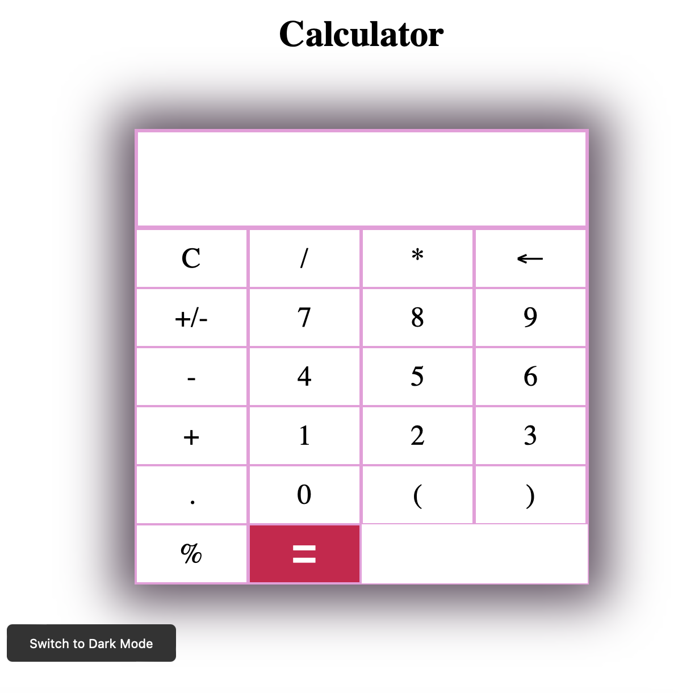
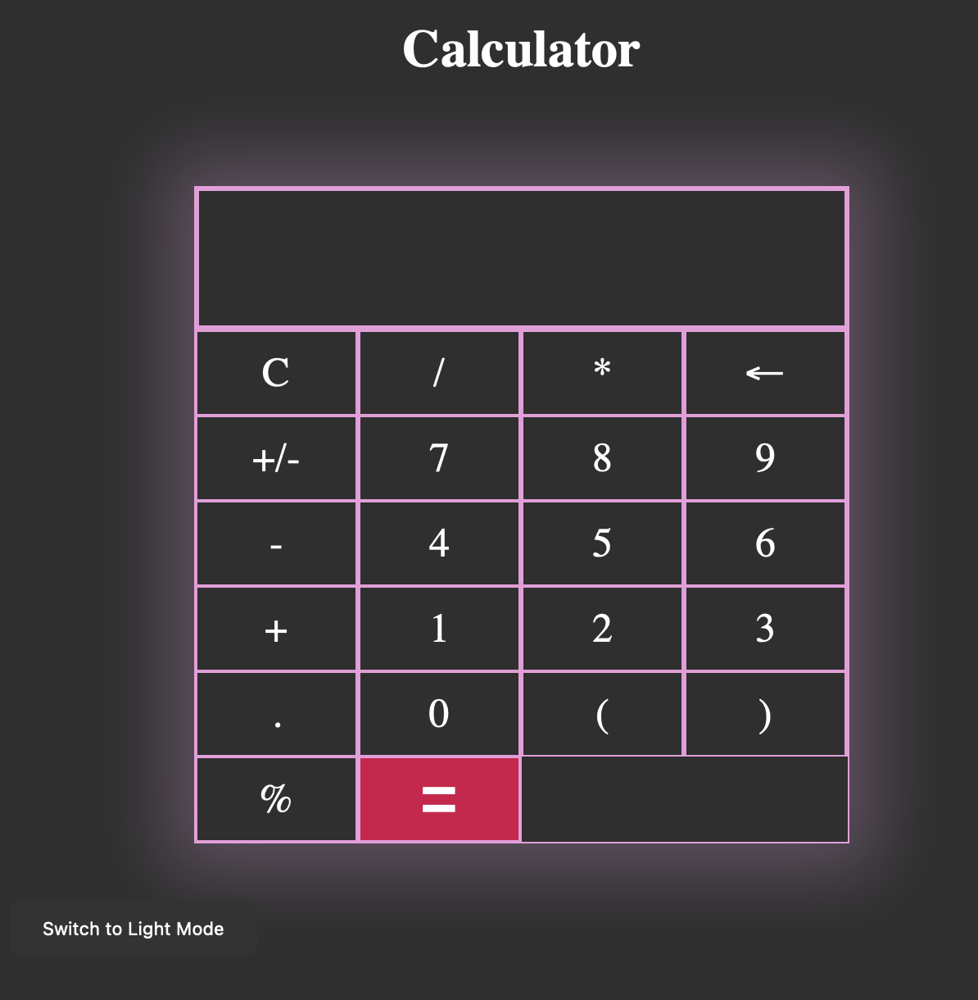

<h1 align="center">Calulator App</h1>

## Overview
This is a simple calculator app built with HTML, CSS, and JavaScript. It provides basic arithmetic operations and a toggleable light and dark mode feature.

## Features
- Addition, subtraction, multiplication, and division operations
- Clear button (C) to reset the calculator display
- Backspace button (&larr;) to delete the last input
- Toggleable light and dark mode for enhanced user experience

## Skills Demonstrated
- Proficiency in HTML, CSS, and JavaScript
- Understanding of DOM manipulation and event handling
- Ability to create a responsive user interface
- Knowledge of Git version control and collaboration on GitHub

## How to Use
1. Clone or download the repository.
2. Open the `index.html` file in a web browser.
3. Use the buttons to perform calculations and interact with the calculator.
4. Toggle between light and dark mode using the "Toggle Mode" button.

## Screenshots

## Acknowledgements
- Built using the knowledge and skills acquired from online tutorials and resources.
- Inspiration from various calculator designs and implementations.

Feel free to explore and use the calculator app as a reference for learning and building your own projects!
